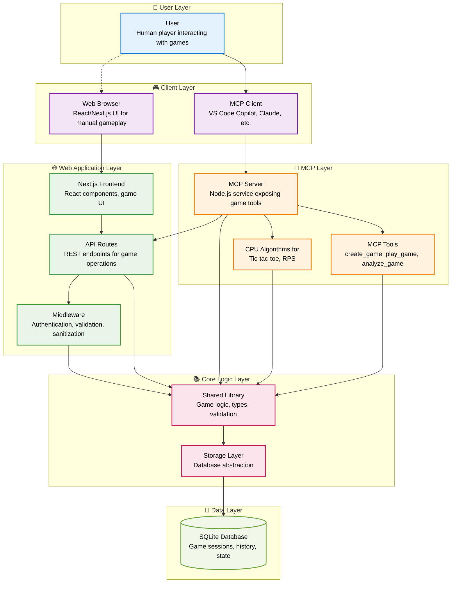
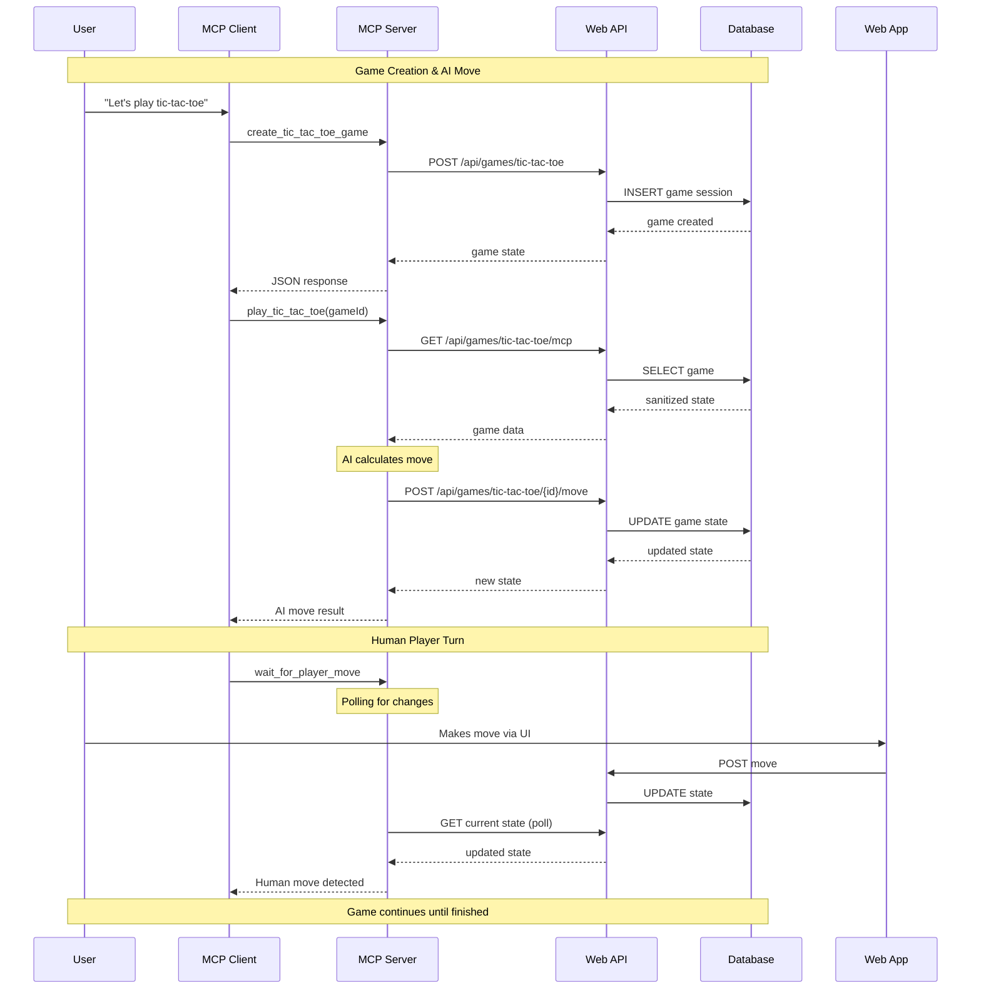

# MCP Architecture Flow Diagram

This document explains how the Model Context Protocol (MCP) works using the turn-based games platform as an example.

## System Architecture

### Component Architecture Diagram


## Interaction Flow Diagram

### Game Session Flow


## How MCP Works: Key Principles

### 1. **Tool-Based Interface**
MCP exposes capabilities as **tools** that AI clients can call:
- `create_tic_tac_toe_game` - Creates a new game
- `play_tic_tac_toe` - Makes an AI move  
- `analyze_game` - Provides game insights
- `wait_for_player_move` - Waits for human input

### 2. **Stateless Communication**
- **MCP Client** sends tool requests with parameters
- **MCP Server** processes requests and returns JSON responses
- No persistent connection - each call is independent

### 3. **Service Integration Pattern**
```typescript
// MCP Server acts as a bridge between AI and existing services
async function play_tic_tac_toe(gameId: string) {
  // 1. Fetch current game state via HTTP
  const game = await httpGet(`${WEB_API_BASE}/api/games/tic-tac-toe/mcp`)
  
  // 2. Calculate AI move locally
  const aiMove = await ticTacToeAI.makeMove(game.gameState, 'medium')
  
  // 3. Submit move back via HTTP  
  const result = await httpPost(`${WEB_API_BASE}/api/games/tic-tac-toe/${gameId}/move`, {
    move: aiMove, 
    playerId: 'ai'
  })
  
  return result
}
```

### 4. **Security Through Sanitization**
```typescript
// Web API provides sanitized endpoints for MCP
// /api/games/rock-paper-scissors/mcp returns:
{
  rounds: [
    {
      player1Choice: undefined, // Hidden from AI
      player2Choice: undefined, // Hidden from AI  
      winner: undefined
    }
  ]
}
```

### 5. **Asynchronous Game Flow**
```
User: "Let's play tic-tac-toe"
  ↓
MCP Client → create_tic_tac_toe_game
  ↓
MCP Client → play_tic_tac_toe (AI makes move)
  ↓  
MCP Client → wait_for_player_move (waits for human)
  ↓
[Human makes move via web app]
  ↓
MCP Client → play_tic_tac_toe (AI responds)
  ↓
[Repeat until game ends]
```

## Detailed Component Breakdown

### MCP Server (`mcp-server/`)
- **Purpose**: Bridge between AI clients and the web application
- **Communication**: Receives tool calls via stdio, makes HTTP requests to web API
- **AI Logic**: Contains game-specific AI algorithms with difficulty levels
- **Direct Dependencies**: Uses shared library for game classes, types, and validation logic
- **Tools Exposed**:
  - Game creation tools (`create_*_game`)
  - Game playing tools (`play_*`)
  - Game analysis tools (`analyze_game`)
  - Flow control tools (`wait_for_player_move`)

### Web Application (`web/`)
- **Frontend**: Next.js application for human players
- **API Routes**: REST endpoints for game operations
- **Database**: SQLite storage for game sessions
- **Security**: Sanitized `/mcp` endpoints that hide sensitive game data

### Shared Library (`shared/`)
- **Game Logic**: Core game rules and validation
- **Types**: TypeScript interfaces for game states and moves
- **Storage**: Database abstraction layer
- **API Client**: HTTP client functions for MCP server

## Key Architectural Dependencies

### Shared Library as Core Foundation
The **Shared Library** serves as the foundational layer that both the Web Application and MCP Server depend on:

- **Game Logic**: Core game rules, move validation, win condition checking
- **Type Definitions**: Common interfaces for game states, moves, and sessions
- **Storage Abstraction**: Database operations and data access patterns

### MCP Server Dependencies
The MCP Server has **direct dependencies** on the shared library:
- **Game Classes**: Imports `TicTacToeGame`, `RockPaperScissorsGame`, etc. for validation
- **Type Safety**: Uses shared TypeScript interfaces for consistent data structures  
- **Analysis Functions**: Calls `getValidMoves()` and other game logic methods directly
- **AI Integration**: AI algorithms use shared types and game state structures

### Dual Data Access Pattern
The architecture uses a **dual access pattern** for security and separation:
- **Web App**: Direct database access via shared storage layer
- **MCP Server**: HTTP API access + shared library for local validation/analysis

## Benefits of MCP Architecture

1. **🔌 Extensibility** - Easy to add new games and AI capabilities
2. **🛡️ Security** - AI can't access sensitive data directly  
3. **🏗️ Separation of Concerns** - Game logic, web UI, and AI are decoupled
4. **🌐 Protocol Agnostic** - Works with any MCP-compatible AI client
5. **📊 Rich Context** - AI gets structured game data, not just text
6. **🎯 Type Safety** - Shared types ensure consistency across all layers

## Example: Complete Game Flow

### 1. Game Creation
```typescript
// User asks: "Let's play tic-tac-toe"
// MCP Client calls:
{
  "tool": "create_tic_tac_toe_game",
  "arguments": {
    "playerName": "Alice",
    "aiDifficulty": "medium"
  }
}

// MCP Server response:
{
  "gameId": "abc123",
  "message": "Created new Tic-Tac-Toe game",
  "gameState": { /* initial game state */ }
}
```

### 2. AI Move
```typescript
// MCP Client calls:
{
  "tool": "play_tic_tac_toe", 
  "arguments": {
    "gameId": "abc123"
  }
}

// MCP Server:
// 1. Fetches game state from web API
// 2. Calculates optimal move using AI algorithm
// 3. Submits move via web API
// 4. Returns updated game state
```

### 3. Wait for Human
```typescript
// MCP Client calls:
{
  "tool": "wait_for_player_move",
  "arguments": {
    "gameId": "abc123",
    "gameType": "tic-tac-toe",
    "timeoutSeconds": 30
  }
}

// MCP Server polls web API until human makes move
// Returns when move detected or timeout occurs
```

This architecture demonstrates MCP as a **bridge protocol** that allows AI assistants to interact with existing applications through well-defined tools, while maintaining security and separation of concerns.

## Technical Implementation Details

### MCP Tool Registration
```typescript
server.setRequestHandler(ListToolsRequestSchema, async () => ({
  tools: [
    {
      name: "create_tic_tac_toe_game",
      description: "Create a new Tic-Tac-Toe game",
      inputSchema: {
        type: "object",
        properties: {
          playerName: { type: "string", default: "Player" },
          aiDifficulty: { 
            type: "string", 
            enum: ["easy", "medium", "hard"],
            default: "medium"
          }
        }
      }
    }
    // ... more tools
  ]
}))
```

### HTTP Integration Pattern
```typescript
// MCP server never accesses database directly
// Always goes through web API for data access
const WEB_API_BASE = process.env.WEB_API_BASE || 'http://localhost:3000'

async function getTicTacToeGameViaAPI(gameId: string) {
  const games = await httpGet(`${WEB_API_BASE}/api/games/tic-tac-toe/mcp`)
  return games.find(game => game.gameState?.id === gameId)
}
```

### Security Considerations
- **Data Sanitization**: MCP endpoints hide sensitive information
- **Input Validation**: All tool arguments validated against schemas
- **Rate Limiting**: Can be implemented at API level
- **Access Control**: Future authentication can be added to API endpoints

This architecture showcases MCP as a powerful pattern for enabling AI assistants to interact with complex applications while maintaining proper boundaries and security.
